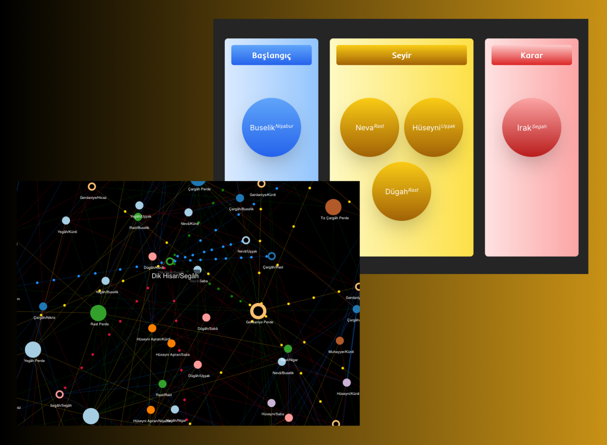

# MakamNetz v1

## 🚀 Features

- **Discover the relationships between scales (Perde) and melodic patterns (Çeşni) in Turkish Music through a visualized network map.**
- **Explore the modeled journeys of Scales and Patterns based on definitions from sources, and listen to sample recordings.**
- **Evaluate the connections between Scales and Patterns within a specific makam (mode). Examine the shared structures needed for transitions between different makams.**

## 🛠️ Technologies Used

- **React**: A JavaScript library for building user interfaces.
- **Mantine**: A modern React component library.
- **Tailwind**: Utility-first CSS framework.
- **React Force Graph 2D/3D**: A library for creating 2D and 3D force-directed graphs.

## 🌐 Live Demo

- [Live Demo](https://makamnetz-v1.vercel.app/)

## 🌟 Lighthouse Score

  

## 🌄 Preview

  

## Author

- LinkedIn - [Gümrah Sindar](https://www.linkedin.com/in/gumrahsindar/)
